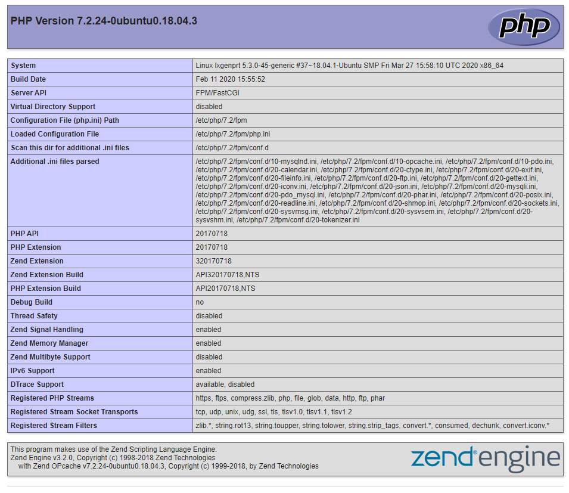

# Peter Moss COVID-19 AI Research Project

## COVID-19 Medical Support System Server

[](https://github.com/COVID-19-AI-Research-Project/COVID19-Medical-Support-System-Server)

# Installation & Setup
The following guide will take you through setting up and installing the  [COVID-19 Medical Support System Server](https://github.com/COVID-19-AI-Research-Project/COVID19-Emegency-Assistance-Robot "COVID-19 Medical Support System Server").  

&nbsp;

# Install Ubuntu 18.04
For this project, the operating system of choice is  [Ubuntu 18.04.1 LTS (Bionic Beaver)](http://releases.ubuntu.com/18.04/ "Ubuntu 18.04.1 LTS (Bionic Beaver)"). To get your operating system installed you can follow the [Create a bootable USB stick on Ubuntu](https://tutorials.ubuntu.com/tutorial/tutorial-create-a-usb-stick-on-ubuntu#0 "Create a bootable USB stick on Ubuntu") tutorial. 

&nbsp;

# Setup Domain Name
Now is as good a time as any to sort out and configure a domain name. You need to have your domain already hosted on a hosting account, from there edit the DNS zone by adding an A record to your public IP, for this you need a static IP or IP software that will update the IP in the DNZ Zone each time it changes. You add your IP as an A record and save your DNS Zone.

&nbsp;

# Setup Port Forwarding
Now you have your domain pointing to your public IP, it is time to add a port forward, traffic to your network will be coming from port 80 (insecure) and secure. Although Nginx will bounce the insecure traffic to port 443, we still need to add a port forward for port 80 as well as 443. 

How you will do this will vary, but you need to find the area of your router that allows you to add port forwards. Then add one port forward for incoming insecure traffic (port 80) to port 80 on your server's IP, and one for secure traffic (port 443) to port 443 on server's IP. Both incoming ports should be forwarded to the same port on your server. 

This will open the HTTP/HTTPS ports on your router and forward the traffic to your server. In the case someone tries to access using insecure protocol (http - port 80) they will be automatically be sent to the secure port of the server (https - 443)

&nbsp;

# Install Server
Now we need to install the GeniSysAI server.

## Automatic Install
A bash script has been put together if you would like to run everything in one go. To do so, use the following command from the project root:

```
sh Scripts/Installation/Install.sh
```

You may find additional debug information in the Manual Install guide below.

## Manual Install
If you would like to manually install everything for more understanding, you can use the following guides. 

### NGINX

Use the following commands to install NGINX.

```
sudo apt-get install nginx
sudo cp /etc/nginx/sites-available/default /etc/nginx/sites-available/default.backup
sudo systemctl status nginx.service
sudo nano /etc/nginx/sites-available/default 
```

- Installs Nginx
- Makes a copy of the default Nginx configuration named default.backup
- Checks the status of the service (server)
- This opens the config file in a text editor called nano. Here you need to edit the default Nginx configuration replacing **_** in **server_name _;** with your domain that you have forwarded to your network using an A record. IE **server_name www.YourDomain.com**. Once you have made your edit you need to press ctrl x to exit to save (if you made the changes), y for yes, and then enter to save the modified file.

```
sudo nginx -t
sudo systemctl reload nginx
```

- Checks if the configuration is OK
- Reloads the Nginx service

You can check the Nginx logs by using the following command:

```
cat /var/log/nginx/error.log
```

### Let's Encrypt
Security is everything, and it is even better when security is free ;) To encrypt our network we are going to use SSL provided by [Let’s Encrypt](https://letsencrypt.org/ "Let’s Encrypt"). Follow the commands below to set up Let’s Encrypt.

Make sure to choose 2 to redirect http (non-secure) to https (secure).

```
sudo add-apt-repository ppa:certbot/certbot
sudo apt-get update
sudo apt-get install python-certbot-nginx
sudo certbot --nginx
```

If you have followed above correctly you should now be able to access your website, but only using the secure protocol, 443, ie: https. If you visit your site you should now see the default Nginx page.

### UFW Firewall
Now you will set up your firewall:

```
sudo ufw enable
sudo ufw disable
```
Now add the ports that we will require to be open: (In future updates these rules will be tightened)

```
sudo ufw allow 22
sudo ufw allow 80
sudo ufw allow 443
```

Finally start and check the status

```
sudo ufw enable
sudo ufw status
```

### MySql
Now it is time to install MySql on your server. Follow the commands below and complete any required steps for the installation to accomplish this. 

**Make sure you keep note of all passwords etc you create.**

**Hints:**

- Do not set up VALIDATE PASSWORD plugin
- Remove anonymous users
- Root restricted to local host
- Remove test database

```
sudo apt-get install mysql-server
sudo mysql_secure_installation
```

Now create a user and password that we will use for phpMyAdmin, first login in with the root MySql username you created earlier and then enter the password when prompted, this will log you into MySql as that user.

```
 mysql -u YourMySqlRootUser -p
```

Now we can create a user with the required permissions to manage phpMyAdmin, make sure you remember the credentials you create with the below command.

```
 mysql> GRANT ALL ON *.* TO 'YourNewUsername'@'localhost' IDENTIFIED BY 'YourNewPassword';
```

Also create a user for your application database.

```
 mysql> GRANT SELECT, INSERT, DELETE  ON *.* TO 'YourNewUsername'@'localhost' IDENTIFIED BY 'YourNewPassword';
```

Finally, create the required database:

```
 mysql> CREATE DATABASE YourDatabaseName
``` 

### PHP
Now you will install PHP on your server. Follow the commands below and complete any required steps for the installation to accomplish this. You may need to swap 7.2 in the second command depending on what version of php-fpm is installed.

```
sudo apt-get install php-fpm php-mysql
sudo nano /etc/php/7.2/fpm/php.ini
```

You should now be in the nano editing window, find  **cgi.fix_pathinfo** and change the value to 0

```
cgi.fix_pathinfo=0
```

Then restart PHP:

```
sudo systemctl restart php7.2-fpm
```

Now create a file in the public html directory called info.php. The following command will open the new file for editing:

```
sudo nano /var/www/html/info.php
```

Then you need to add the following code:

```
<?php
    phpinfo();
```

If you now visit the info page your website ie: https://www.YourDomain.com/info you should see the PHP configuration of your server.



&nbsp;

# Contributing

The Peter Moss Acute Myeloid & Lymphoblastic Leukemia AI Research project encourages and welcomes code contributions, bug fixes and enhancements from the Github.

Please read the [CONTRIBUTING](https://github.com/COVID-19-AI-Research-Project/COVID19-Medical-Support-System-Server/blob/master/CONTRIBUTING.md "CONTRIBUTING") document for a full guide to forking our repositories and submitting your pull requests. You will also find information about our code of conduct on this page.

## Contributors

- **AUTHOR:** [Adam Milton-Barker](https://www.leukemiaresearchassociation.ai.com/team/adam-milton-barker "Adam Milton-Barker") - [Peter Moss Leukemia AI Research](https://www.leukemiaresearchassociation.ai "Peter Moss Leukemia AI Research") Founder & Intel Software Innovator, Sabadell, Spain

&nbsp;

# Versioning

We use SemVer for versioning. For the versions available, see [Releases](https://github.com/COVID-19-AI-Research-Project/COVID19-Medical-Support-System-Server/releases "Releases").

&nbsp;

# License

This project is licensed under the **MIT License** - see the [LICENSE](https://github.com/COVID-19-AI-Research-Project/COVID19-Medical-Support-System-Server/blob/master/LICENSE "LICENSE") file for details.

&nbsp;

# Bugs/Issues

We use the [repo issues](https://github.com/COVID19-Medical-Support-System-Server/issues "repo issues") to track bugs and general requests related to using this project. See [CONTRIBUTING](https://github.com/COVID19-Medical-Support-System-Server/blob/master/CONTRIBUTING.md "CONTRIBUTING") for more info on how to submit bugs, feature requests and proposals.