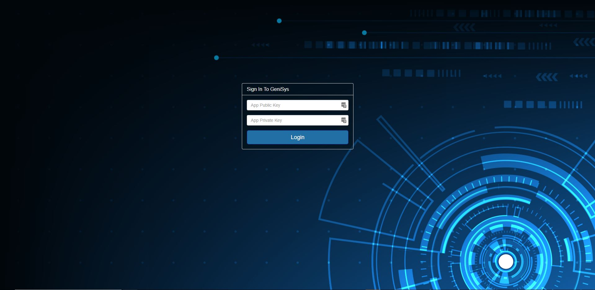

# Peter Moss COVID-19 AI Research Project

## COVID-19 Medical Support System Server

# Introduction

The Peter Moss COVID-19 Medical Support System Server is a locally hosted, online medical support system, providing an easy to use control panel to communicate with, monitor and control Peter Moss COVID-19 AI Research Project projects such as the [COVID-19 Emergency Assistance Robot](https://github.com/COVID-19-AI-Research-Project/COVID19-Emegency-Assistance-Robot "COVID-19 Emergency Assistance Robot") and the [COVID-19 IoT Devices](https://github.com/COVID-19-AI-Research-Project/COVID19-IoT-Devices "COVID-19 IoT Devices") & AI projects.

## GeniSysAI

This project leverages [GeniSysAI](https://github.com/GeniSysAI/ "GeniSysAI"), an open source Artificial Intelligence Assistant Network using Computer Vision, Natural Linguistics and the Internet of Things. GeniSysAI uses a system based on [TASS A.I](https://github.com/TASS-AI/TASS-Facenet "TASS A.I") for [vision](https://github.com/GeniSysAI/Vision "vision"), an [NLU engine](https://github.com/GeniSysAI/NLU "NLU engine") for natural language understanding, in browser speech synthesis and speech recognition for speech and hearing, all homed on a dedicated Linux server in your office and managed via a secure UI.

For this project we will create our own systems, as well as system previously created in the GeniSysAI project.

# About GeniSysAI Server
[GeniSysAI Server](https://github.com/GeniSysAI/Server "GeniSysAI Server") is a customisable management system for [GeniSysAI](https://github.com/GeniSysAI/Server "GeniSysAI") networks. The GeniSys management system is built on top of [Ubuntu 18.04.1 LTS (Bionic Beaver)](http://releases.ubuntu.com/18.04/ "Ubuntu 18.04.1 LTS (Bionic Beaver)"), but there should be no issues using other Linux operating systems. The server uses a secure PHP/MySql Nginx server, [Let’s Encrypt](https://letsencrypt.org/ "Let’s Encrypt") for free SSL encryption, and free IoT connectivity via the [iotJumpWay](https://www.iotJumpWay.tech "iotJumpWay").

Although the completed GeniSys Server will be accessible via the outside world, this is only to help ensure encrypted traffic over your local network. The Nginx server will proxy traffic to your internal IPs for features such as the local NLU, the local TASS system is designed to access the local camera of the device the program is running on.

&nbsp;

# Contributing

The Peter Moss Acute Myeloid & Lymphoblastic Leukemia AI Research project encourages and welcomes code contributions, bug fixes and enhancements from the Github.

Please read the [CONTRIBUTING](https://github.com/COVID19-Medical-Support-System-Server/blob/master/CONTRIBUTING.md "CONTRIBUTING") document for a full guide to forking our repositories and submitting your pull requests. You will also find information about our code of conduct on this page.

## Contributors

- **AUTHOR:** [Adam Milton-Barker](https://www.leukemiaresearchassociation.ai.com/team/adam-milton-barker "Adam Milton-Barker") - [Peter Moss Leukemia AI Research](https://www.leukemiaresearchassociation.ai "Peter Moss Leukemia AI Research") Founder & Intel Software Innovator, Sabadell, Spain

&nbsp;

# Versioning

We use SemVer for versioning. For the versions available, see [Releases](https://github.com/COVID-19-AI-Research-Project/COVID19-Medical-Support-System-Server/releases "Releases").

&nbsp;

# License

This project is licensed under the **MIT License** - see the [LICENSE](https://github.com/COVID-19-AI-Research-Project/COVID19-Medical-Support-System-Server/blob/master/LICENSE "LICENSE") file for details.

&nbsp;

# Bugs/Issues

We use the [repo issues](https://github.com/COVID19-Medical-Support-System-Server/issues "repo issues") to track bugs and general requests related to using this project. See [CONTRIBUTING](https://github.com/COVID19-Medical-Support-System-Server/blob/master/CONTRIBUTING.md "CONTRIBUTING") for more info on how to submit bugs, feature requests and proposals.