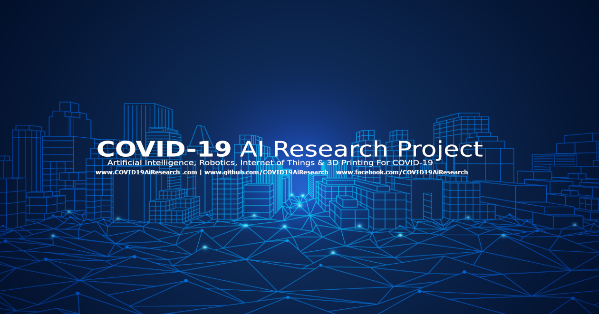

# Peter Moss COVID-19 AI Research Project

## COVID-19 Medical Support System Server

# Introduction

The Peter Moss COVID-19 Medical Support System Server is a locally hosted, secure NGINX server powering an online medical support system based on [GeniSysAI](https://github.com/GeniSysAI/ "GeniSysAI"). The server and support system provide an easy to use control panel to communicate with, monitor and control Peter Moss COVID-19 AI Research Project projects such as the [COVID-19 Emergency Assistance Robot](https://github.com/COVID-19-AI-Research-Project/COVID19-Emegency-Assistance-Robot "COVID-19 Emergency Assistance Robot"),  the [COVID-19 IoT Devices](https://github.com/COVID-19-AI-Research-Project/COVID19-IoT-Devices "COVID-19 IoT Devices") & AI projects.
 
The COVID-19 Medical Support System is the server/network control panel providing direct access, monitoring and controlling of all Peter Moss COVID-19 AI Research Project projects. In addition to hosting the control panel, the NGINX server acts a proxy to IoT devices on the local network, allowing them to be accessed from the outside world securely, and to host API's allowing access to AI models. 

IoT connection is also secure and managed via the [iotJumpWay](https://www.iotJumpWay.com "iotJumpWay"), future releases will include a secure local MQTT broker built into the project with the option to bridge to the iotJumpWay for additional features.

# GeniSysAI

This project leverages [GeniSysAI](https://github.com/GeniSysAI/ "GeniSysAI"), an open source Artificial Intelligence Assistant Network using Computer Vision, Natural Linguistics and the Internet of Things. GeniSysAI uses a system based on [TASS A.I](https://github.com/TASS-AI/TASS-Facenet "TASS A.I") for [vision](https://github.com/GeniSysAI/Vision "vision"), an [NLU engine](https://github.com/GeniSysAI/NLU "NLU engine") for natural language understanding, in browser speech synthesis and speech recognition for vocal interaction with the network, and is all homed on a dedicated Linux server on your own premises.

## About GeniSysAI Server
[GeniSysAI Server](https://github.com/GeniSysAI/Server "GeniSysAI Server") is a customisable management system for [GeniSysAI](https://github.com/GeniSysAI/Server "GeniSysAI") networks. The GeniSys management system is built on top of [Ubuntu 18.04.1 LTS (Bionic Beaver)](http://releases.ubuntu.com/18.04/ "Ubuntu 18.04.1 LTS (Bionic Beaver)"), but there should be no issues using other Linux operating systems. The server uses a secure PHP/MySql Nginx server, [Let’s Encrypt](https://letsencrypt.org/ "Let’s Encrypt") for free SSL encryption, and free IoT connectivity via the [iotJumpWay](https://www.iotJumpWay.com "iotJumpWay").

Although the completed GeniSys Server will be accessible via the outside world, this is only to help ensure encrypted traffic to devices on your local network and web systems. 

&nbsp;

# The COVID-19 Medical Support System Server

- Installation: Please follow the [Installation Guide](Documentation/Installation.md "Installation Guide")

&nbsp;

# Contributing

The Peter Moss Acute Myeloid & Lymphoblastic Leukemia AI Research project encourages and welcomes code contributions, bug fixes and enhancements from the Github.

Please read the [CONTRIBUTING](https://github.com/COVID-19-AI-Research-Project/COVID19-Medical-Support-System-Server/blob/master/CONTRIBUTING.md "CONTRIBUTING") document for a full guide to forking our repositories and submitting your pull requests. You will also find information about our code of conduct on this page.

## Contributors

- **AUTHOR:** [Adam Milton-Barker](https://www.leukemiaresearchassociation.ai.com/team/adam-milton-barker "Adam Milton-Barker") - [Peter Moss Leukemia AI Research](https://www.leukemiaresearchassociation.ai "Peter Moss Leukemia AI Research") Founder & Intel Software Innovator, Sabadell, Spain

&nbsp;

# Versioning

We use SemVer for versioning. For the versions available, see [Releases](https://github.com/COVID-19-AI-Research-Project/COVID19-Medical-Support-System-Server/releases "Releases").

&nbsp;

# License

This project is licensed under the **MIT License** - see the [LICENSE](https://github.com/COVID-19-AI-Research-Project/COVID19-Medical-Support-System-Server/blob/master/LICENSE "LICENSE") file for details.

&nbsp;

# Bugs/Issues

We use the [repo issues](https://github.com/COVID19-Medical-Support-System-Server/issues "repo issues") to track bugs and general requests related to using this project. See [CONTRIBUTING](https://github.com/COVID19-Medical-Support-System-Server/blob/master/CONTRIBUTING.md "CONTRIBUTING") for more info on how to submit bugs, feature requests and proposals.